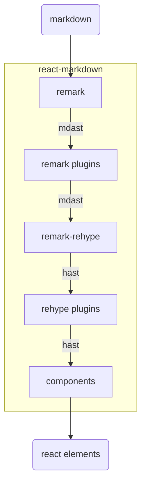

## ポートフォリオサイト兼ブログを作った

個人ブログを作ったといっても、以前からポートフォリオサイトやブログ自体はすでに実装したことがあった。今回はそれらのリニューアルで、サイト自体も0から作ったし、ブログも0から書いていきたいと考えている。なのでまぁ、初記事といっても差し支えないだろう。

## Azuma-ya.dev を支える技術

- [TypeScript](https://www.typescriptlang.org/)
  必須である。もう型がなければ生きていけない体になってしまった。
- [React](https://react.dev/)、[Next.js](https://nextjs.org/)
  メインフレームワーク。よく使っている。
- [Cloudflare Pages](https://pages.cloudflare.com/)
  デプロイ先である。
- [unified.js](https://unifiedjs.com/)、[remark](https://github.com/remarkjs/remark?tab=readme-ov-file#syntax-tree)、[rehype](https://github.com/rehypejs/rehype)
  Markdownをhtmlに変換するために利用しています。今回は[React Markdwon](https://github.com/remarkjs/react-markdown)も利用した。

### Markdownの変換

今までに[React Markdown](https://github.com/remarkjs/react-markdown)を使用したことはあったが、今回は独自記法も採用したかったため、[remark](https://github.com/remarkjs/remark)、[rehype](https://github.com/rehypejs/rehype)に入門してみた。入門といっても、ほんのさわりしかしていないので、理解はしていない。

今回実装したのは上記の

- remark plugins
- remark-rehypeのhandlers
- components

である。

#### Remark plugins

ここのプラグインで独自記法を検知して、mdastに変換する。検知といっても、今回行ったのはremark directiveライブラリを利用して、カスタムディレクティブを実装したくらいである。今後はより自分好みな記法を実装したい。なおremark directiveに関しては、[remark directive](https://github.com/remarkjs/remark-directives)を参考にしてほしい。

#### Remark-rehypeのhandlers

remark-rehypeのhandlersで、mdastをhastに変換する。独自実装したmdastを対応するhtmlの構文木に直す必要があるためだ。

#### Components

remark-rehypeのhandlersで、hastをreact componentsに変換する。独自記法を直接htmlに直しても大丈夫なのだが、せっかくなのでreact componentsを実装しそれを利用することにした。

したがって、remark-rehypeのhandlersでは独自記法のMarkdownを独自のhtmlタグに直している。

### Markdownのレンダリング

以下のページにAzuma-ya.devで利用できるMarkdownの記法についてまとめた。

https://azuma-ya.dev/blogs/markdown

## 終わりに

日々考えたこと、感じたこと、学んだことを発信していきたいと思う。
