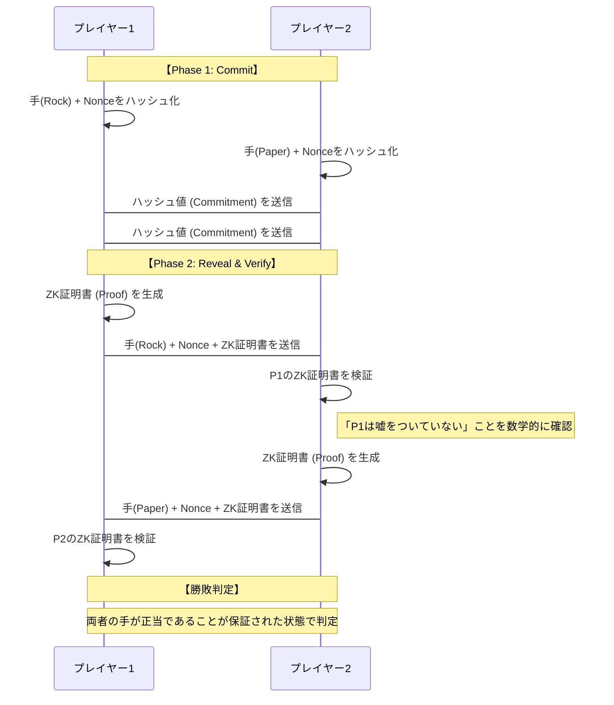
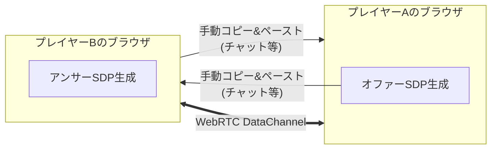

# ZK P2P Rock-Paper-Scissors

## 概要

「ZK P2P Rock-Paper-Scissors」は、ゼロ知識証明（Zero-Knowledge Proofs）とピアツーピア（P2P）通信を組み合わせた、サーバーレスな対戦型ジャンケンゲームです。中央サーバーを一切介さず、WebRTC DataChannels を利用してプレイヤー間で直接通信を行い、SnarkJS と Circom を用いたゼロ知識証明によって「後出し」や「不正な手」を数学的に防止します。

プライバシーを極限まで重視し、ゲームの進行状況や通信内容がサーバーに記録されることはありません。また、ゼロ知識証明をブラウザ上で完結させている点が大きな技術的特徴です。サーバーレスオンラインゲームの開発を目標に、単純な「じゃんけん」を実装しました。

## 想定ユーザー / ユースケース

- **プライバシーを重視するユーザー**: 通信ログやプレイ履歴を残したくない人。
- **Web3 / ZK技術に関心がある開発者**: ゼロ知識証明のブラウザ実装や、サーバーレスなP2Pアプリケーションの実例を学びたい人。
- **セキュアな対戦ゲームを求める人**: 中央管理者がいない環境でも、数学的な保証によって公平な対戦を楽しみたい人。

## 使用技術（Tech Stack）

### フロントエンド

- **React 19**: 最新のReactライブラリを使用した、コンポーネントベースのUI開発。
- **TypeScript**: 型安全性による堅牢なコードベース。
- **Vite**: 高速な開発サーバーおよびビルドツール。

### UI / スライリング

- **Tailwind CSS 4**: モダンなユーティリティファーストのCSSフレームワーク。
- **Lucide React**:一貫性のあるアイコンセット。

### 状態管理 / データ

- **Zustand**: 軽量で直感的なグローバル状態管理。

### ブラウザAPI

- **WebRTC DataChannels**: サーバーを介さないリアルタイムのP2P通信。
- **Web Crypto API**: 高速な暗号処理とハッシュ生成。

### 開発環境

- **Bun**: 高速なJavaScriptランタイムおよびパッケージマネージャー。
- **SnarkJS / Circom**: ゼロ知識証明の回路作成と証明生成・検証。

## 主な機能

1. **サーバーレスP2P対戦**:
   - WebRTCの手動シグナリングにより、サーバー不要で接続を確立。SDP（Session Description）をコピー＆ペーストするだけで対戦を開始できます。
2. **ゼロ知識証明による公平性の保証**:
   - **Commit-Revealプロトコル**: 手を出す前にハッシュ値（コミットメント）を交換し、後から手（Reveal）を公開します。
   - **不正防止**: 公開された手が、最初にコミットした手と一致すること、および「グー・チョキ・パー（0, 1, 2）」のいずれかであることを、手そのものを明かす前にZK証明で保証します。
3. **ローカル完結型の処理**:
   - ZK証明の生成と検証はすべてユーザーのブラウザ上で行われ、秘密鍵（Salt/Nonce）や選択した手が外部に送信されることはありません。

## 技術的ポイント：詳細解説

### 1. ゼロ知識証明（ZK）を活用した対戦フロー

本ゲームでは、相手に手を知られずに「私は正当な手を選びました」と証明し、後から「最初に選んだのはこの手です」と証明するために **Commit-Revealプロトコル** を採用しています。

### 2. P2P接続：サーバーレス・シグナリング

通常、WebRTC接続には仲介役のサーバーが必要ですが、本プロジェクトでは**手動シグナリング**によってサーバーへの依存を100%排除しています。

### 3. 初心者向け：Circom（サーコム）とは？

**Circom** は、ゼロ知識証明のための「計算回路（Circuit）」を作る専門の言語です。

> [!TIP] > **パズルに例えると...**
>
> あなたはある「難しいパズル（計算問題）」を解いたとします。相手に対して「正解そのもの」は見せたくないけれど、「確かに解いた（正解を知っている）」ということだけは信じてもらいたい...。
>
> そのための**「魔法の解答用紙（回路）」**を作るのが Circom です。
>
> 1. あなたは Circom で「正解ならOK、不正ならエラー」と答える回路を設計します。
> 2. あなたが手元で回路に答え（秘密の入力）を入れると、**「ZK証明書」**が発行されます。
> 3. 相手はその「ZK証明書」と「回路のルール」を見るだけで、あなたの答えが正解であることを100%確信できます。

本プロジェクトの Circom 回路（`hand_integrity.circom`）では、以下の2点を厳格にチェックしています：

- **手の正当性**: 入力された値が「0（グー）、1（チョキ）、2（パー）」のいずれかであること。
- **改ざん防止**: 出力されたハッシュ値が、自分の公開鍵や現在のラウンド番号、選んだ手から正しく計算されたものであること。

### 4. 堅牢なセキュリティ設計

- **リプレイアタック対策**: ハッシュ生成に `roundNumber` を含めることで、過去の証明を再利用して不正を行うことを防いでいます。
- **Poseidonハッシュ**: ZK技術での計算効率が非常に高い、Web3時代のモダンなハッシュ関数を採用しています。

## 動作条件（重要）

- **モダンなブラウザ**: WebRTC および WebAssembly (for SnarkJS) が動作する最新のブラウザが必要です。
- **手動接続**: 対戦相手と何らかの手段（チャットツールなど）で接続情報を一回交換する必要があります。
- **ZK証明の計算負荷**: ブラウザ上で証明を生成するため、一時的にCPU負荷が高くなる場合があります（数秒程度）。

## 今後の改善案

- **シグナリングの自動化**: 必要に応じて、利便性向上のためのオプションとしてシグナリングサーバーへの対応。
- **ターンベースから同時進行への拡張**: 複数の対戦を並行して行えるスケーラブルな設計への変更。
- **他ゲームへの応用**: このZK P2P基盤を、ポーカーや将棋などのより複雑なボードゲームに応用。
